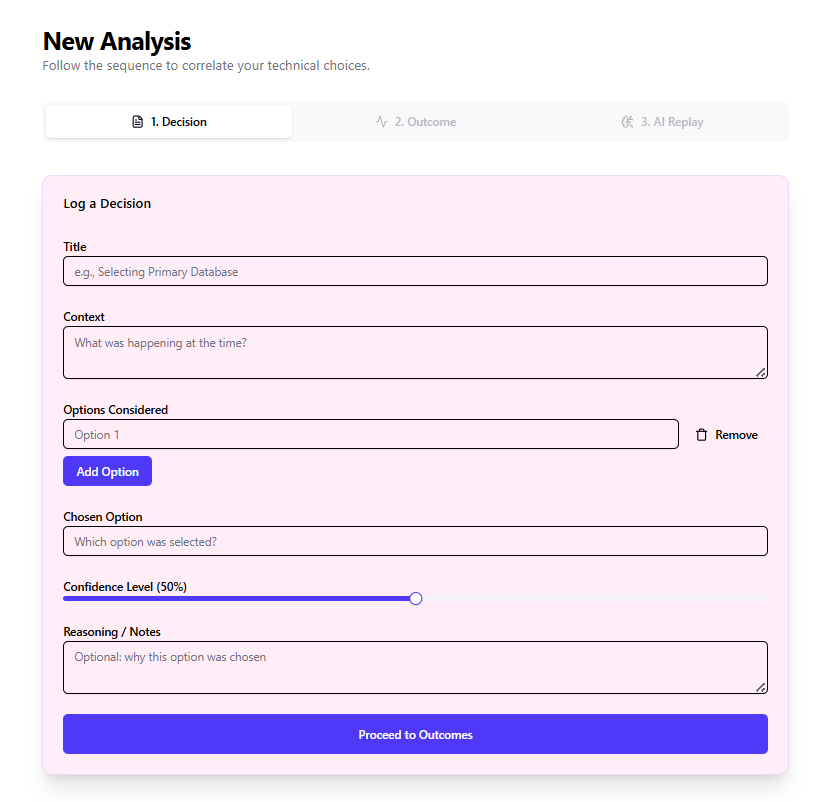
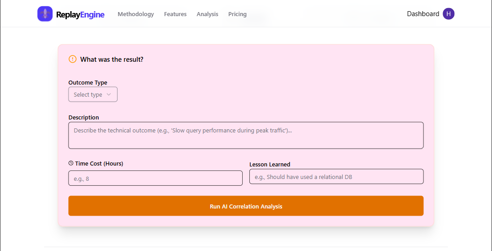
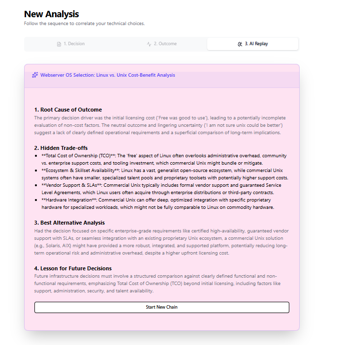

# Decision Replay Engine

  

**Decision Replay Engine** is an AI-powered tool to **track, analyze, and optimize your decisions**. Visualize outcomes, measure confidence, and improve your decision-making process over time.

---

## 🚀 Features

- Record and manage decisions effortlessly  
- Track outcomes and lessons learned  
- Analyze confidence vs. actual results  
- AI-powered insights to optimize future decisions  
- User-friendly dashboard for quick overview  
- Responsive design – use on desktop or mobile  

---

## 📸 Screenshots

### Decision Logger Form

### Decision Outcome Logger

### AI Analysis

---

## 💻 Installation

1. Clone the repository:  
   git clone https://github.com/jeet7122/decision-replay-engine.git

2. Install dependencies:  
   cd decision-replay-engine  
   npm install

3. Set up environment variables (e.g., database URL, API keys) in `.env` file.

4. Run the app locally:  
   npm run dev

5. Open [http://localhost:3000](http://localhost:3000) in your browser.

---

## ⚡ Usage

1. Sign up or log in.  
2. Add a new decision with context, options, and expected outcome.  
3. Track the outcome once it’s realized.  
4. Review AI-generated insights to improve future decisions.

---

## 🌟 Why Use Decision Replay Engine?

- Improve your personal or professional decision-making  
- Track patterns and lessons learned over time  
- Get actionable insights without manual analysis  
- Makes decision-making data-driven  

---

## 🛠 Tech Stack

- Frontend: Next.js, React, Tailwind CSS  
- Backend: Node.js, Drizzle ORM, Neon Database  
- Authentication: Clerk  
- AI Insights: Custom AI module  

---

## 🤝 Contributing

Contributions are welcome! Please open issues or submit pull requests with improvements or bug fixes.  

---

## 📄 License

This project is licensed under the MIT License – see the LICENSE file for details.  

---

## 🔗 Links

- Live Demo: https://decision-replay-engine.vercel.app  
- Documentation: https://github.com/jeet7122/decision-replay-engine/wiki

---
